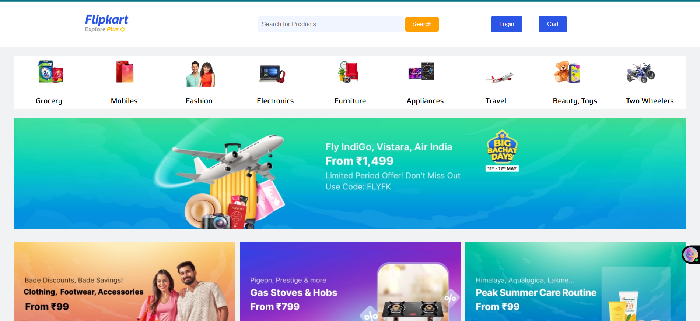

🛒 Flipkart Clone

A Flipkart homepage clone built using HTML and CSS.
Designed for learning front-end development and practicing responsive layouts.

✨ Features

Responsive layout similar to Flipkart.

Navigation bar, banners, and product sections styled using CSS.

Educational project for practicing HTML5 and CSS3.

Easy to extend with JavaScript for interactivity.

🛠 Technologies Used

HTML5 — Structure of the website

CSS3 — Styling and layout

(Future: JavaScript for dynamic functionality)

💻 Installation

Clone the repository:

git clone https://github.com/techi-rg/Flipkart-clone.git

Go into the project directory:

cd Flipkart-clone

Open index.html in your browser to see the homepage.

📸 Project Preview

Flipkart Clone Homepage

🚀 Future Improvements

Add JavaScript for interactive components (carousel, dropdowns, cart).

Make it fully responsive for mobile and tablet devices.

Use real product data for demonstration.

Add hover effects and animations for a better UI.

🤝 Contributing

Contributions are welcome!

Fork the repo

Create a branch: git checkout -b feature-name

Make your changes and commit: git commit -m "Add new feature"

Push to branch: git push origin feature-name

Open a Pull Request

📄 License

This project is open-source under the MIT License.